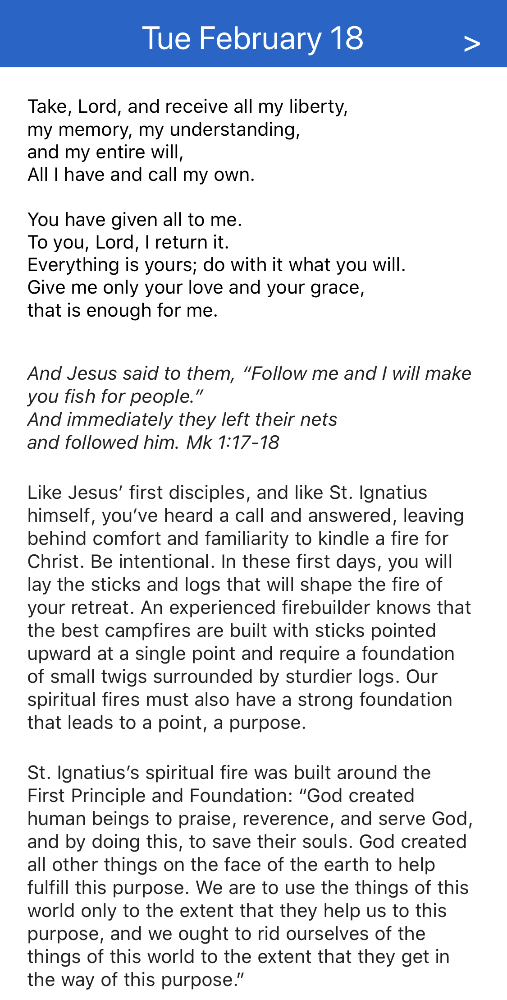
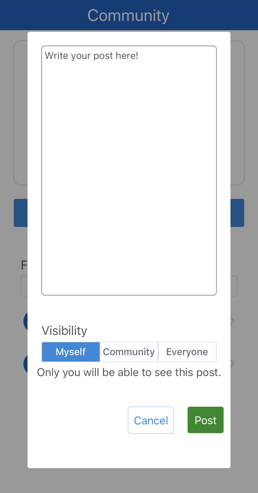

# Ignite

http://ignite.eliblaney.com

Ignite is a retreat in daily life modeled on the Spiritual Exercises of Saint Ignatius of Loyola. Like an ordinary retreat, Ignite allows retreatants to take a step back from distractions and burdens in order to pray and reflect more deeply in a small community of peers. Unlike an ordinary retreat, Ignite preserves ordinary obligations and socialization, but creates an opportunity for prayerful silence by removing other distractions like social media, alcohol, and video games.

The Ignite app is a React Native app built mainly using JavaScript. It utilizes a custom backend server and Firebase to provide an effective online retreat experience.

## Building

To build Ignite, you will need to clone this repository and setup a Firebase account and a backend service to respond to Ignite API requests. The backend service used by Ignite will soon be available on GitHub.

## Availability

Ignite is currently in **beta**. It is planned to release in February 2021.

## Screenshots

Reflection Page            |  Editing a post
:-------------------------:|:-------------------------:
  |  
